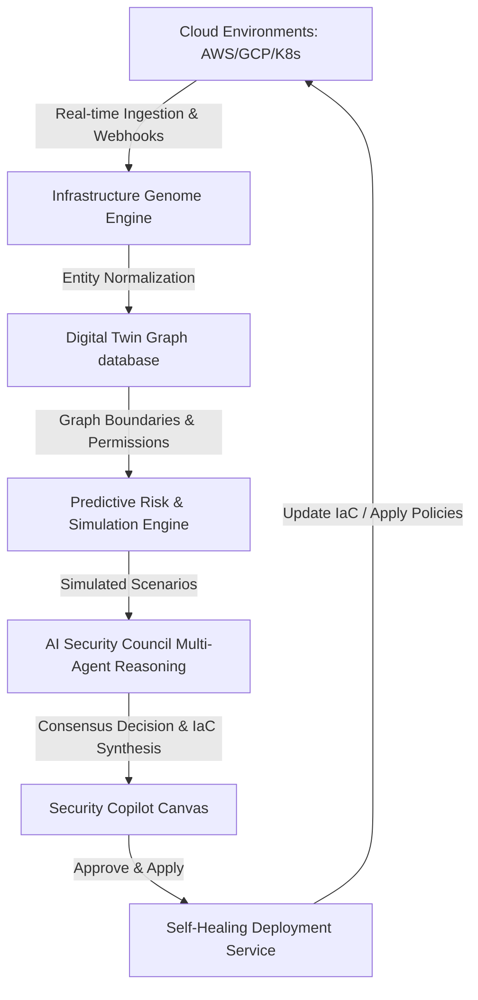
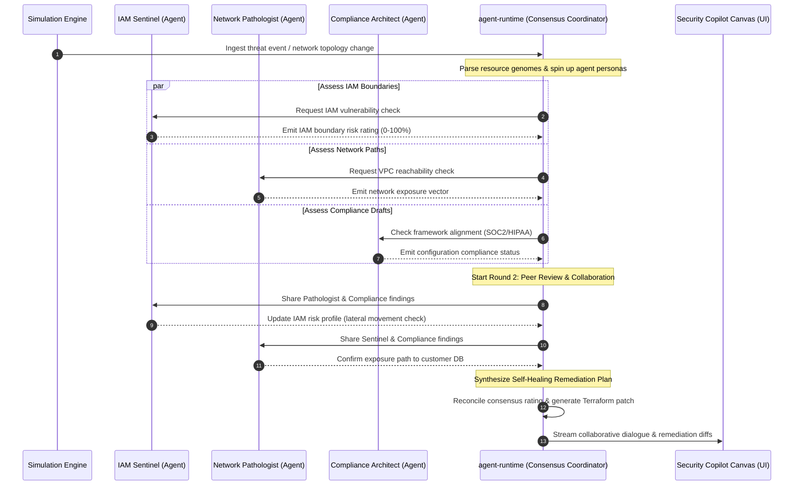
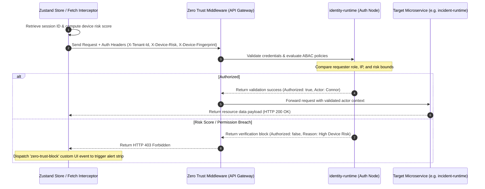
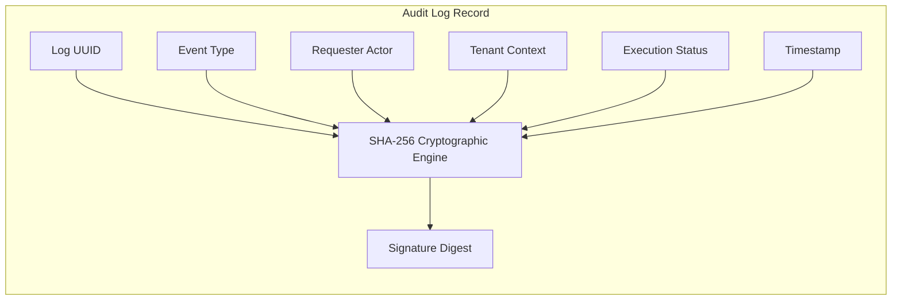

# CloudGuard AI System Architecture

This document describes the high-level design, operational models, sequence flows, and cryptographic verification processes of CloudGuard AI, the Autonomous Cloud Security Operating System.

---

## 🏗 Real-Time Digital Twin Ingestion Flow

Rather than querying cloud provider APIs on demand and displaying static tables, CloudGuard AI constructs a real-time reactive graph representation of all resources, identities, routes, and relationships.

---

## 🤖 AI Security Council Consensus Sequence

When a threat vector is identified (or simulated through a dry-run deployment), it is routed to the **AI Security Council**. This sequence maps how the specialized security personas collaborate to reach consensus on remediation plans.

---

## 🔐 Inbound Request Zero-Trust Authorization Handshake

CloudGuard AI operates on a Zero-Trust verification boundary. Every frontend fetch request is intercepted to inject security context metadata headers, which backend microservices validate before responding.

---

## 💾 Cryptographic Verification & Verification Trails

To prevent database tampering and maintain strict compliance trails, Audit Log entries and Compliance Evidence records are cryptographically signed using SHA-256 digests.

Any modification to these fields invalidates the signature, triggering high-severity alerts inside the Platform Operations Center.
